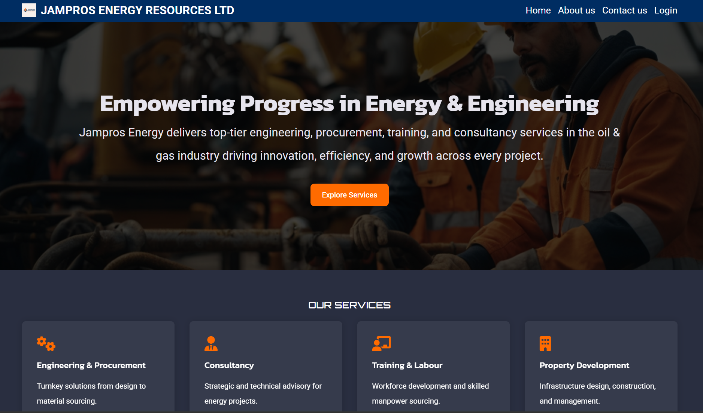

# Jampros

Welcome to the JamPros website — a modern digital presence built for an innovative oil and gas company. This project reflects my ability to design and develop industry-specific websites that are both functional and visually impactful.

## Features

- **Responsive Design**: The website is fully responsive and looks great on devices of all sizes.
- **Smooth Navigation**: The navigation menu allows easy access to different sections of the portfolio.
- **Contact & Inquiry Integration**: Includes an easy-to-use contact form and integrated map for client outreach.
- **Performance Optimized**: Fast-loading pages and SEO-friendly structure to improve discoverability.

## Technologies Used

## Preview
